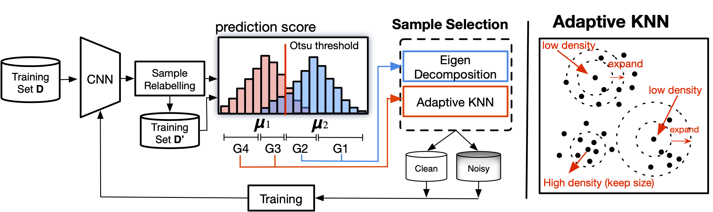

# ANNE: Adaptive Nearest Neighbors and Eigenvector-based Sample Selection for Robust Learning with Noisy Labels
This repository is the official implementation of ANNE: [Adaptive Nearest Neighbors and Eigenvector-based Sample Selection for Robust Learning with Noisy Labels](https://doi.org/10.1016/j.patcog.2024.111132) (Pattern Recognition 2024).

<b>Authors</b>: Filipe R. Cordeiro and Gustavo Carneiro


## Illustration



## Requirements
- This codebase is written for `python 3.7.12`.
- To install necessary python packages, run `pip install -r requirements.txt`.

## Training and Evaluating

To train and evaluate the model, for CIFAR dataset, run the following code:

```bash 
python3 main_cifar_ANNE.py --dataset_path ${dataset_path}  --dataset [cifar10|cifar100] --noise_ratio ${noise_rate} --gpuid 0 --exp-name ${exp_name}  --gamma_r ${gamma_r}  --gamma_e ${gamma_e}  --epochs ${epochs}  --warmup ${warmup}
```

An example of training RestNet-18 on CIFAR-100 with 50% noise rate:

```bash
python3 main_cifar_ANNE.py --dataset_path /datasets  --dataset cifar100 --noise_ratio 0.5  --gpuid 0 --exp-name ANNE_cifar100_nr0.5  --gamma_r 0.5  --gamma_e 0.1  --epochs 300  --warmup 30
````

In this example, the test results and trained model will be saved on folder "cifar100/ANNE_cifar100_nr0.5/"

To train and evaluate the model, for Animal10n dataset, run the following code:
```bash 
python3 main_animal10n_ANNE.py --dataset_path ${dataset_path}  --gpuid 0 --exp-name ${exp_name}  --gamma_r 0.95  --gamma_e 0.3  --epochs 150  --warmup 1
```

To train and evaluate the model, for CIFAR-10/100 dataset with IDN noise , run the following code:
```bash 
python3 main_idn_cifar_ANNE.py   --dataset_path ${dataset_path} --dataset [cifar10|cifar100]  --noise_ratio ${noise_rate}  --gpuid 0 --exp-name ${exp_name}  --gamma_r ${gamma_r}  --gamma_e ${gamma_e}  --epochs 300  --warmup 30
```

<b>Cite ANNE</b>\
If you find the code useful in your research, please consider citing our paper:

```
@article{cordeiroAnne24,
  title={ANNE: Adaptive Nearest Neighbors and Eigenvector-based Sample Selection for Robust Learning with Noisy Labels},
  author={Cordeiro, F. R. and  Carneiro, Gustavo},
  journal={Pattern Recognition},
  volume={159},
  year={2024}
}
```
## Contact
Please contact filipe.rolim@ufrpe.br if you have any question on the codes.